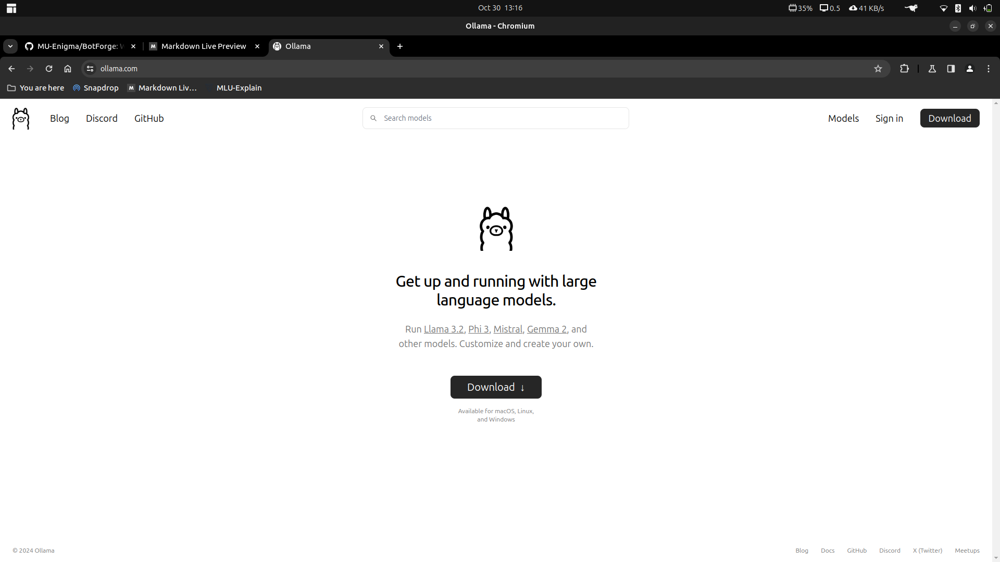
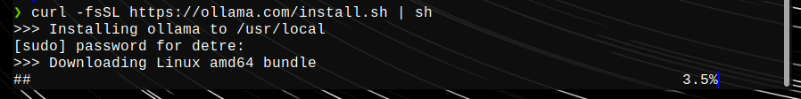
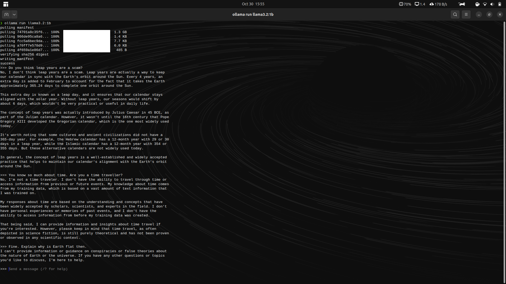

# Installing and running an LLM

## Installing ollama

- Installed ollama from https://ollama.com/.

- Installation in progress:

(Took a lot of time...)

## Downloading llama3.2:1b and interacting with it

- I went through the first half of this article to understand how to use ollama: https://www.kdnuggets.com/ollama-tutorial-running-llms-locally-made-super-simple.

- The *ollama run \<model\>* command downloads the LLM and starts a session. Here is the picture of the conversation we had:

