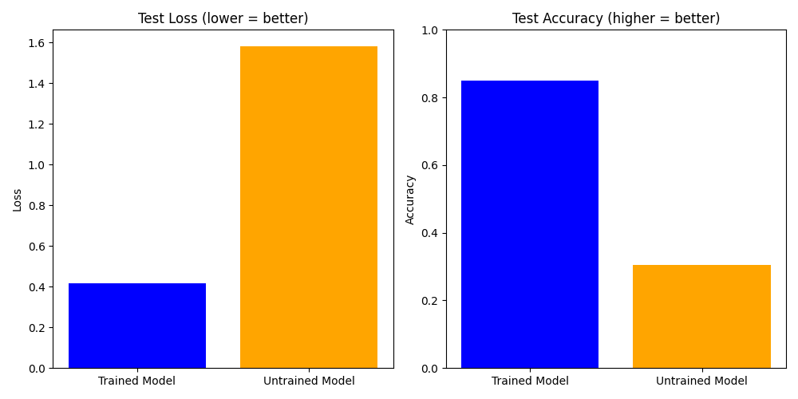

# Objective
Use the BERT model and the PubMed-RCT dataset to classify a medical abstract. Since the baseline-BERT model is not designed for this purpose, we will be fine-tuning it with the custom dataset in hopes for better performance (foreshadowing - it does perform better).

---

# List of Things
### Model and Its Specs
Offered specs, which will be changed during training:
- **Model**: `bert-base-uncased`
    - **Architecture**: BERT Base (12 layers, 768 hidden units, 12 attention heads)
    - **Parameters**: Approximately 110 million
    - **Casing**: Uncased (i.e., all lowercase inputs)
    - **Max Sequence Length**: 512
    - **Total Classes**: 5 (as per the dataset)

### Hyperparameters
From what I used (feel free to tinker with them):
1. **Batch Size**: 128
2. **Epochs**: 1
3. **Max Sequence Length**: 256 (512 was taking too long for training)
4. **Num Workers**: 12 (use as many cores as your CPU allows)
5. **Loss Function**: Adam (`lr=1e-5`, `weight_decay=0.01`)
6. **Trainable Layers**: All layers in BERT
7. **Mixed-Precision Training**: True (I used it for faster training time)

> *Note: Everything is the same for the untrained model too.*

---

# Results
The trained model performs better than the untrained model. The trained model achieved ≃85% testing accuracy, while the untrained model achieved ≃30% accuracy. The following plot illustrates these results.

---

# Scope for Improvement
The BERT model was only fine-tuned for 1 epoch with a static learning rate (lr). However, adding a learning rate scheduler and increasing the number of epochs may yield higher accuracy in the model's predictions.

---

# Things to Look Out For When Replicating
1. **Training Speed**: If the model is taking too long to train, try to increase the batch size (if memory allows) and/or reduce the maximum sequence length. If these don't reduce the training time sufficiently, consider try using mixed-precision training, which can improve speed and reduce memory usage.
2. **Dataloader Issue on macOS**: If you're creating the DataLoaders on macOS, set `num_workers = 0` instead of using the number of CPU cores. This is some kinda bug in PyTorch.
3. **Learning Rate**: Since we are fine-tuning the BERT model, try to keep the 'lr' relatively low, this way we can preserve the patterns the BERT model has already learnt.
4. **Evaluation Metrics**: Try to compare the model's using other metrics than the loss and the accuracy. Try to use the model's F1-score to get a deeper insight towards the model's performance.
5. **Device agonistic code**: Make sure to move the model and the dataloader-batches to the correct device.
    - **MPS**: for macOS systems `device = "mps" if torch.backends.mps.is_available() else "cpu"`
    - **Cuda**: for nvidia GPUs  `device = "cuda" if torch.cuda.is_available() else "cpu"`
    - **CPU**: for CPU `device = "cpu"`
    - **NumPy**: If you would like to use NumPy for any further analysis/operations, then move the model's outputs (logits) to the *CPU*. Same goes for the dataloader-batches.

> *Tip: Always save the models, especially if your using Google-colab. Your runtime may get dumped, and you may lose all your progress, so just save the model and download them.*

---